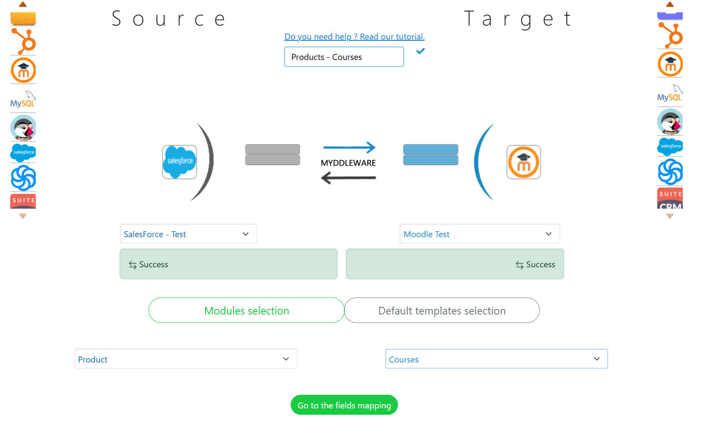

# Myddleware

> Welcome to the Myddleware community and thank you for joining us!

[](https://www.codacy.com/gh/Myddleware/myddleware/dashboard?utm_source=github.com&amp;utm_medium=referral&amp;utm_content=Myddleware/myddleware&amp;utm_campaign=Badge_Grade)
[](https://github.com/Myddleware/myddleware)


[](https://github.com/Myddleware/myddleware/issues)
[](https://github.com/Myddleware/myddleware/issues?q=is%3Aissue+is%3Aclosed)
[](https://github.com/Myddleware/myddleware/blob/main/LICENSE)

[](https://github.com/Myddleware/myddleware/graphs/contributors)
[](https://www.myddleware.com/)
[](https://docsify.js.org/)

[](https://www.youtube.com/channel/UCxI0ziSiRXXTqQ-XfFJr7-w)
<a href="https://www.opensourceagenda.com/projects/myddleware"></a>

Myddleware is the customisable free open-source platform that facilitates data migration and synchronisation between applications.



[On our documentation website,](https://myddleware.github.io/myddleware) you’ll find everything you’re looking for to master Myddleware, including step-by-step tutorials. You can also tailor Myddleware to your needs by creating you custom code. Please use [our github](https://github.com/Myddleware) to share it.

This community is ours : let’s all contribute, make it a friendly, helpful space where we can all find what we’re looking for!

Please don’t hide any precious skills from us, whether it is coding, translation, connectors creation, .... the list goes on! The whole community could then benefit from these!

%[{ connectors.md }]%

Find us here : [www.myddleware.com](https://www.myddleware.com)

*We created it, you own it!*

%[{ requirements.md }]%

## Install Myddleware

### Download Myddleware

You can download Myddleware in 3 different ways :

<!-- tabs:start -->

#### **Git clone**

If you are familiar with Git, Github & command lines, you can clone our [Github repository](https://github.com/Myddleware/myddleware)

#### Setting up the project

At the root of your webserver (for example /var/wwww/html), open a terminal and type the following command:

```git
git clone git@github.com:Myddleware/myddleware.git 
 ```

or

```git
git clone https://github.com/Myddleware/myddleware.git
```

Then, navigate to the newly created Myddleware folder with :

```bash
cd myddleware 
```

#### Install PHP dependencies with Composer

```bash
composer install 
```

#### Install Javascript libraries

```bash
yarn install 
```

#### Build assets

```bash
yarn build 
```

#### **Donwload zip archive**

Download the Myddleware zip file [here](https://www.myddleware.com/wp-content/uploads/myddleware/myddleware-4.2.1.zip)

#### Installing from the archive

Once you've downloaded our ready-to-use Myddleware archive, you need to unzip it at the root of your webserver directory (for example /var/www/html). You can unzip it manually or using the following command :

```bash
unzip myddleware.zip -d <myddleware_dirname>
```

#### **Docker install**

##### Basic setup

Start by cloning the repository inside a directory (the command below will not create a directory but clone inside the current directory)

git clone https://github.com/Myddleware/myddleware.git .

To set your password you have two options : either in .env or when you run docker compose up -d

with the arguments in the command:

mysql_password=myStrongPass mysql_root_password=myRootPass docker-compose up -d

or in .env:

mysql_password=myStrongPass
mysql_root_password=myRootPass

then run docker compose up -d

after this, all you have to do next is to to the url, if it is a local docker then you can go to

http://localhost:30080/index.php/

then click on the install button and follow the instructions.

by default, the information for the mysql connection will be as follow

host: mysql

port: 3306

database name: myddleware

sql user: myddleware

sql password: secret

##### Using the Myddleware Makefile

> Make isn't available on Windows systems. If you want to use them on your Windows machine, you will need to set up [WSL](https://docs.microsoft.com/en-us/windows/wsl/).

Various useful commands are available on our [Makefile](https://github.com/Myddleware/myddleware/blob/main/Makefile). For instance, you can use the following to build & run the Docker container for Myddleware :

```bash
## List all your Docker containers
make ps

## Run Myddleware with Docker Compose
make run-with-compose

## Run Myddleware with Docker
make build
make run
```

##### Building with docker-compose (developer's mode)

###### Build the container locally

Run the following commands in your myddleware directory :

```docker-compose
docker-compose up --build

```

Once your container is built, you can now go to <http://localhost:30080>, where you should see the Myddleware homescreen.

To connect to the MySQL database, including in the myddleware installation, use the following credentials :

- **host** : mysql
- **username** : root
- **password** : secret
- **database** : myddleware
- **port** : 3306

note that you can set the password in the docker.env.example, instead of secret:

mysql_root_password=MyCustomPassword
mysql_password=MyCustomPassword

##### Building with Docker (developer's mode)

###### Build the container

If you choose to build Myddleware using Docker on its own, you will need to set up your database environment variables and connect Myddleware to it as this image doesn't provide a Myddleware database.

```docker
docker build . -t myddleware
```

###### Run

```docker
docker run -d -p 30080:80 myddleware
```

You can then access your Myddleware instance by going to ```http://localhost:30080/index.php```

<!-- tabs:end -->

### Setting up cron jobs in Docker or Linux

To enable scheduled tasks in your Docker container (or linux machine / WSL), you'll need to install and configure cron. Follow these steps:

#### Inside the Docker container

1. Install nano and cron:

```bash
apt update
apt install -y cron nano
```

2. Open the crontab editor:

```bash
crontab -e
```

3. Add the following line to run the Myddleware cron command every 5 minutes:

```bash
*/5 * * * * cd /var/www/html && /usr/local/bin/php bin/console myddleware:cronrun --env=background >> /var/log/cron.log 2>&1
```

**Note:** You can only use the `cronrun` command if you have Myddleware Premium. If you don't have Premium, use:

```bash
*/5 * * * * cd /var/www/html && /usr/local/bin/php bin/console myddleware:synchro ALL --env=background >> /var/log/cron.log 2>&1
```

4. Save and exit the editor.

5. Start the cron service:

```bash
service cron start
```

#### Running the foreground script

In the `docker/script` directory, run:

```bash
./myddleware-foreground.sh
```

If you encounter a permission denied error, grant execute permissions:

```bash
chmod +x myddleware-foreground.sh
```

For Windows, you can use the Task Scheduler and create a task that executes the command.

## Setting up your Myddleware environment

At this stage, to set up Myddleware, you can either follow our installation wizard by going to your Myddleware URL or if you're comfortable with using a terminal, you can execute a series of commands.

<!-- tabs:start -->
### **Setup from the web browser**

You need to go to the URL where Myddleware will be located, for instance : ```http://<yourdomain>.com/<myddlewarefolder>/myddleware/public/```
From there, you need to click on "Install Myddleware" and follow the directions of the Installation Wizard.

#### Check requirements

Here, Myddleware will check whether your server meets all the requirements for Myddleware to be able to run (are there any missing PHP extensions ? are there any permissions issues ?)

#### Connect to your Myddleware database

Before proceeding to this step, please ensure you've already created the database you intend to use for Myddleware. Then you can fill in the form. Once you've saved & clicked next, Myddleware will attempt to connect to the database using the information you've provided. If there are any errors, a message will appear to let you know what went wrong. If everything is OK, you can continue to the next step.

#### Create your Myddleware admin user

Fill in the form to create your Myddleware credentials (email, username & password). Once this is done, you should be redirected to the Myddleware homepage.

### **Setup from a terminal**

#### Create your environment file

At the root of your /myddleware directory, you need to create a .env.local file (it should be at the same level as the .env & .env.example files). If you've followed the installation from GitHub above, all you will need to do here is to fill in the .env.local file with the following information :

```env
DATABASE_HOST=your_host
DATABASE_PORT=your_port
DATABASE_NAME=your_dbname
DATABASE_USER=your_db_username
DATABASE_PASSWORD=your_db_password

APP_ENV=prod
APP_DEBUG=false
APP_SECRET=ThisSecretIsNotSoSecretChangeIt
MAILER_URL=gmail://smtp.example.com:465?encryption=ssl&auth_mode=login&username=&password=
```

The DATABASE_URL variable will contain the values used by Myddleware to connect to your actual database, so you must replace each placeholder value with your credentials.

The MAILER_URL is optional. It is used by Myddleware to send you notification emails on some occasions such as when a task failed or some documents are in error. You need to configure it to match your SMTP server's credentials.

#### Generating your Myddleware database

Open a terminal at the root of your myddleware project. Run the following command to generate the Myddleware tables in the database :

```bash
php bin/console doctrine:schema:update --force
 ```

Now, in order to add the initial Myddleware dataset, run :

```bash
php bin/console doctrine:fixtures:load --append
 ```

 You should now be able to generate your Myddleware admin user, either by using the ```php bin/console myddleware:add-user``` command or by going directly into your browser : ```http://<yourdomain>.com/<myddlewarefolder>/myddleware/public/register``` where a form will prompt you to create your Myddleware admin user.


<!-- tabs:end -->

## Contributing

> Myddleware relies on the [Symfony Framework](https://symfony.com/), a free open-source PHP framework. If you would like to contribute to our source code, you can first familiarise yourself with the [Symfony documentation](https://symfony.com/doc/current/index.html)

Myddleware is an Open Source community project. All contributions are welcome, no matter how big or small. There are many ways to contribute to the project.
You can of course help us improve and debug our source code, but you can also start by simply reporting issues & bugs or suggesting new features on our [GitHub Issues forum](https://github.com/Myddleware/myddleware/issues), or review and leave comments on [Pull Requests](https://github.com/Myddleware/myddleware/pulls).

If you would like to contribute to Myddleware source code, please refer to the [developer's guide](dev_guide.md) section of this documentation. We also kindly ask 
that you follow the [Symfony Coding Standards](https://symfony.com/doc/current/contributing/code/standards.html) to ensure uniformity and clarity of our source code across Myddleware.
We recommend using the [PHP CS Fixer](https://github.com/FriendsOfPhp/PHP-CS-Fixer) tool to ensure these standards are respected across your contributed code.

