# Advanced Usage

## Filters

You can apply filters to the data you want to send into your target application. 
To do so, click on the “Filters” tab while creating or editing your rule.

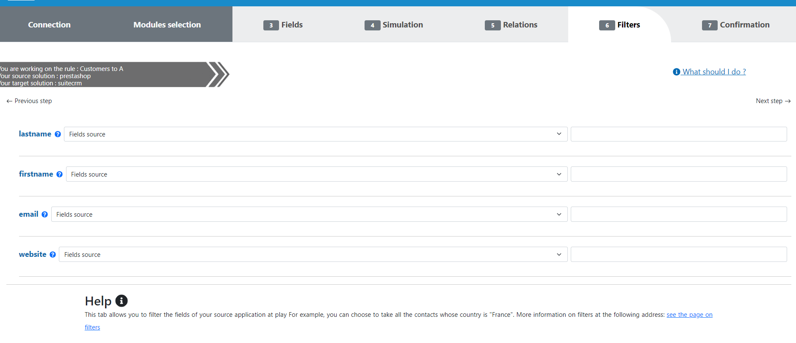

For each of your fields, you can select from a pre-set list of filters to apply.

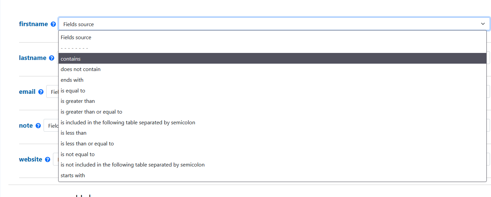

And then input the reference to use as a filter. Myddleware will apply this filter to this field inside your rule, meaning
that only the documents matching this exact filter will be sent to the read() method. 

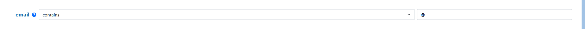

## Formulae

> Myddleware embarks a set of valuable tools to facilitate data transformation, including the possibility to add what we call ``formulae``.
> Inside the Myddleware UI, you can create your own formulae to manipulate data before it is being transferred from your source application to your target.
> For instance, let's image your source application contains a ``first_name`` & a ``last_name`` field, but your target application only accepts a ``fullName`` field.
> This is no problem, as you can add a formula on the ``fullName`` target field in which you will be able to concatenate the 2 source fields for example.
> This is a basic example, however you are free to make much more complex formulae if you wish, thanks to a bunch of built-in PHP functions embarked with Myddleware.

### Fundamentals

For starters, formulas allow you to format or to set the values that will be sent to a given target field.
In other words, you have the option of adding fixed text to all uppercase, change timezones, concatenate several source fields etc.
From inside the Myddleware UI, you can create & peruse the available methods to create formulae during the rule creation process,
during the field mapping step. Indeed, once you've added a source field into a target field, you may then click on the ``Add formula`` button of
each target field and then a modal window will open allowing you to add your formula.

### Syntax

To help, functions are able to perform various operations (1).
You can see the result at the bottom of the formula pop up (2).

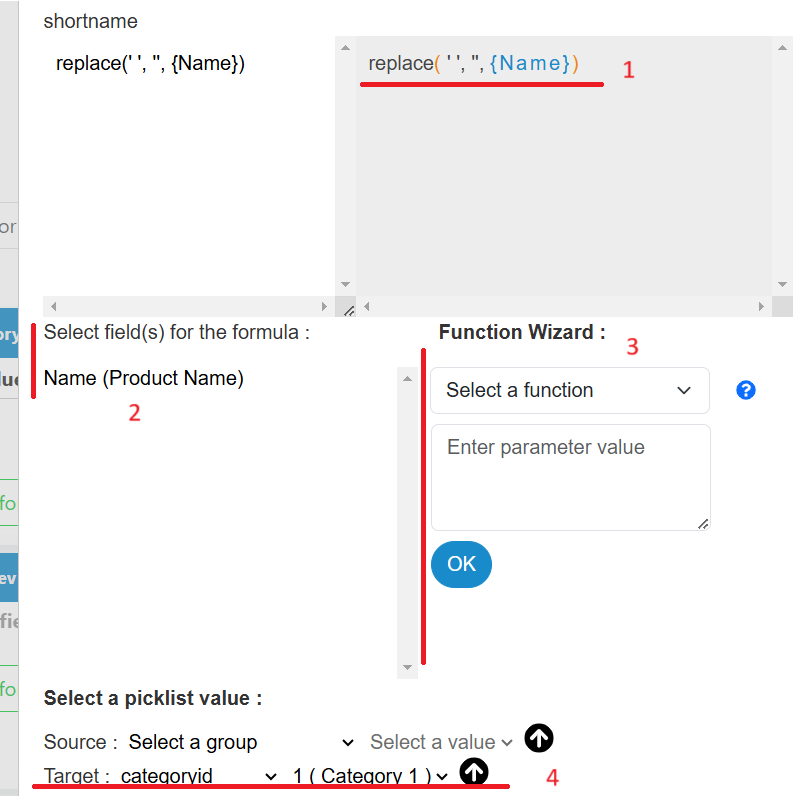

**Examples**

- To concatenate multiple fields, Myddleware uses the ``.`` symbol, just like in PHP

````php
{field1}.{field2}.' '.{field3}
{salutation}.' '.{first_name}.' '.{last_name}        // e.g. Miss Mary Spears
````
- To concatenate a fixed text with one or multiple fields “Client Name: “.{Firstname}.” “.{Lastname}

- Three-valued condition , “If the Greeting field is ‘Mr.’ then send 1, otherwise send 2” is written as followed : (({Greeting} == “Mr.”) ? “1” : “2”), those three-valued conditions can be nested in order, for example, to make the data correspond. Thus, ({resolution} == “10” ? “Open” : ({resolution} == “20” ? “Fixed” : ({resolution} == “30” ? “Reopened” : “Suspended”))) is correct and functional, this formula means “If resolution is 10 then ‘Open’ is sent, otherwise if resolution is 20 then ‘Fixed‘ is sent, otherwise if resolution is 30 then ‘Reopened’ is sent, otherwise ‘Suspended ‘ is sent.

- Add two fileds {field1} + {field2}

In this article we‘ll look at an important point in your synchronization rules and one of the many setting options offered by Myddleware, formulas.

**Functions**

In the formula of Myddleware, you can use the functions listed at the bottom right (see of the previous image).


Rounds a float, ([PHP](https://www.php.net/manual/fr/function.round.php)) **round(number [, clarification])**:

        round(525.6352, 2) // Returns 525.64

Rounds up, ([PHP](https://www.php.net/manual/fr/function.ceil.php)) **ceil(float)**:

        ceil(525.6352) // Returns 526

Returns the absolute value, ([PHP](https://www.php.net/manual/fr/function.abs.php)) **abs(number)**:

        abs(-5) // Returns 5

Deletes spaces (or other characters) at the beginning and the end of a string, ([PHP](https://www.php.net/manual/fr/function.trim.php)) **trim(string [, Masque])**:

        trim(” bonjour “) // Returns “bonjour”

Lowercases all characters, ([PHP](https://www.php.net/manual/fr/function.mb-strtolower.php)) **lower(STRING)**:

        lower(“BONJOUR”) // Returns “bonjour”

Uppercases all charachters, ([PHP](https://www.php.net/manual/fr/function.mb-strtoupper.php)) **upper(String)**:

        upper(“bonjour”) // Returns “BONJOUR”

Formats a local date/hour, ([PHP](https://www.php.net/manual/fr/function.date.php)) **date(Format [, Timestamp])**:

        date(“Y:m:d”) // Returns “2014:09:16”

Returns current Unix timestamp with microseconds, ([PHP](https://www.php.net/manual/fr/function.microtime.php)) **microtime([true if you want a float result])**:

        microtime(true) // Returns 1410338028.5745

Changes the timezone of the given date, ([PHP](https://www.php.net/manual/fr/timezones.php)) **changeTimeZone(Date you want to change, old timezone, new timezone)**:

        changeTimeZone(“2014-09-16 12:00:00”, “America/Denver”, “America/New_York”) // Returns “2014-09-16 14:00:00”

Changes the format of the given date, **changeFormatDate(Date you want to change, New format)**:

        changeTimeZone(“2014-09-16 12:00:00”, “Y/m/d H:i:s”) // Returns “2014/09/16 12:00:00”

Reads a string starting of the given Index, ([PHP](https://www.php.net/manual/fr/function.mb-substr.php)) **substr(String, Indexample)**:

        substr(“abcdef”, -1) // Returns “f”

Strips HTML and PHP tags from a string, ([PHP](https://www.php.net/manual/fr/function.strip-tags.php)) **striptags(String)**:

        striptags(“<p>Test paragraph.</p><!– Comment –> <a href=”#fragment”>Other text</a>”) // Returns “Test paragraph. Other text”

Lookup target IDs from source IDs from a previous rule and vice versa, **lookup(field, rule_id, errorifempty, errorifnotfound)**:

        lookup({Contact__c},"6b5432f1xxxxx",0,0)

Constant function that allows you to not send the selected field.
        
        "mdw_no_send_field"
        
Constant function that allows you to cancel the actual document

        "mdw_cancel_document"

## Linking Data Across Rules with Lookup Formulas

When transferring data between applications, you often need to link related records across different rules. For example, when sending Moodle ``Users`` to Salesforce ``Contacts``, you may need to reference the Salesforce ``Account ID`` that was created by a previous rule that transferred Moodle ``Users`` to Salesforce ``Accounts``.

**The recommended approach is to use the `lookup()` function in formulas**, which allows you to retrieve target IDs from source IDs from a previous rule and vice versa.

### Using the Lookup Function

The lookup function is the modern and recommended way to link data across rules. It retrieves the corresponding ID from a related rule based on the source data.

**Syntax:**
```php
lookup(field, rule_id, errorifempty, errorifnotfound)
```

**Parameters:**
- `field`: The source field containing the ID you want to lookup
- `rule_id`: The ID of the related rule where the mapping exists
- `errorifempty`: Set to 1 to generate an error if the field is empty, 0 otherwise
- `errorifnotfound`: Set to 1 to generate an error if no match is found, 0 otherwise

### Use Case 1: One-to-Many Relationships

> A One-to-Many relationship is when data from 1 module of your source app is sent to multiple modules in your target app.
For instance, the data from the Users module in Moodle will be sent to both Accounts & Contacts modules in Salesforce.

#### Concrete Example

First, create a rule which sends Moodle ``Users`` to Salesforce ``Accounts``.


Note the Rule ID (you can find it in the URL or in the rule list). For example: `6b5432f1xxxxx`

Then, create a second rule which will send data from the same Moodle ``Users`` to Salesforce ``Contacts``.
Map some fields such as firstname, lastname, and email.

Note this second rule's ID as well (e.g., `7d8765h3zzzzz`). You'll use it in Use Case 2 below.

In this second rule, to link the Contact to the Account created in the first rule, add a formula to the ``AccountId`` field (the field that links Contacts to Accounts in Salesforce):

```php
lookup({id},"6b5432f1xxxxx",0,0)
```

This formula will:
- Take the Moodle user ``id`` from the current record
- Look up the corresponding Salesforce Account ID in rule `6b5432f1xxxxx` (the Users→Accounts rule)
- Return that Account ID so the Contact will be linked to the correct Account

Now save the rule and run it. Don't forget to select a reference date in the past if you want to retrieve data which already exists in Moodle.

When you open a document, you will see that Myddleware has successfully linked the Contact to the correct Account using the lookup formula.

### Use Case 2: Many-to-One Relationships

> A Many-to-One relationship is when data from multiple modules of your source app is sent to a single module in your target app.
For instance, data from ``Users`` & ``Course Enrollments`` modules in Moodle might both need to reference the same ``Contact`` in Salesforce.

#### Concrete Example

Assume you already have a rule that sends Moodle ``Users`` to Salesforce ``Contacts`` (rule ID: `7d8765h3zzzzz` - this is the second rule from Use Case 1 above).

Now you want to create a rule that sends Moodle ``Course Enrollments`` to Salesforce ``Campaign Members``, and you need to link each enrollment to the correct Contact that was created from the user.

In your Enrollments to Campaign Members rule, when mapping the Contact reference field (e.g., ``ContactId``), use this formula:

```php
lookup({userid},"7d8765h3zzzzz",0,1)
```

This will:
- Take the ``userid`` from the enrollment record
- Look up the corresponding Salesforce Contact ID from rule `7d8765h3zzzzz` (the Users→Contacts rule)
- Set ``errorifnotfound`` to 1, which will generate an error if the user hasn't been synchronized yet (ensuring data integrity)

This approach ensures that enrollments are only created when the related contacts exist in Salesforce. The same Contact may be referenced by multiple enrollments, creating a Many-to-One relationship.

### Benefits of Lookup Formulas

- **Flexibility**: Can be used in any formula field, combined with other functions
- **Error Handling**: Built-in options to handle missing data
- **Simplicity**: No need for separate relationship configuration tabs
- **Maintainability**: Easy to understand and modify directly in field formulas

---

### Legacy Relationships Feature (Deprecated)

!> **DEPRECATED**: The Relationships tab feature is deprecated and should not be used for new rules. Use the `lookup()` function in formulas instead (see above).

In earlier versions of Myddleware, relationships were configured through a dedicated "Relationships" tab during rule creation. This approach required selecting source fields, related rules, and target fields through a separate interface.

While this feature still exists for backward compatibility with existing rules, it is no longer the recommended approach. The Relationships tab method is more complex, less flexible, and harder to maintain than using lookup formulas directly in field mappings.

**If you have existing rules using the old Relationships tab**, they will continue to work, but consider migrating to lookup formulas when updating or refactoring your rules for better maintainability and clarity.

## Bidirectional rules

In our example, we have only shown you how to send data from Moodle to Salesforce.
But in reality, Myddleware allows you to send data in both directions, from Moodle to Salesforce and from Salesforce to Moodle (for example).

One of the rules we have created is sending Moodle Users to Salesforce Contacts.
In this case, only modifications in Moodle will be sent to Salesforce. But if the contact is modified in Salesforce,
the modification won't be sent to Moodle.

So let's create a new rule which will send Salesforce contacts updates to Moodle.
Select the same modules and connectors you used in your previous rule but in the opposite direction :

- source: Salesforce > ``Contacts``
- target: Moodle > ``Users``


Map some fields such as ``firstname``, ``lastname`` and ``email`` for instance.

!> Make sure you don't use a field that will be updated everytime like the modification date of the record, you could create an infinite loop otherwise !

Go to validation. A new field will be displayed ie "Bidirectional synchronization" in addition to the opposite rule.
Select the opposite rule and click on "Confirm" :

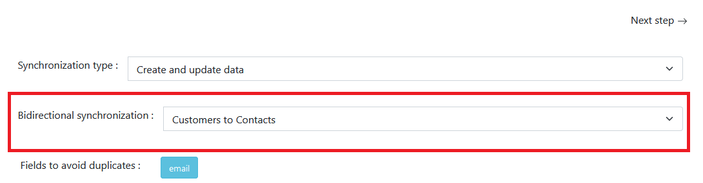

The opposite rule is displayed on the rule's detailed view :

Activate both rules. Now, to test your bidirectional rule, modify a user in Moodle, go to the rules list view
and click on ``Execute all active rules`` :

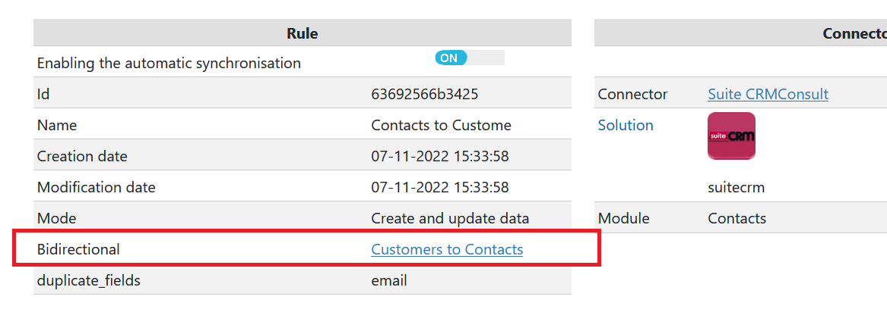

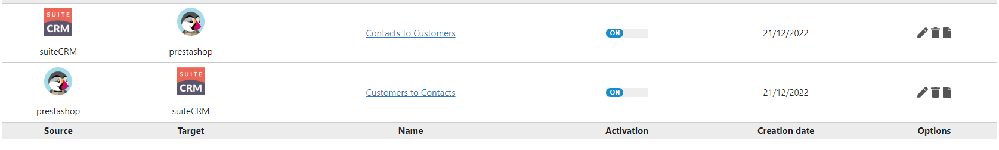

Now open the task, you will see the contact that has been sent to Salesforce.

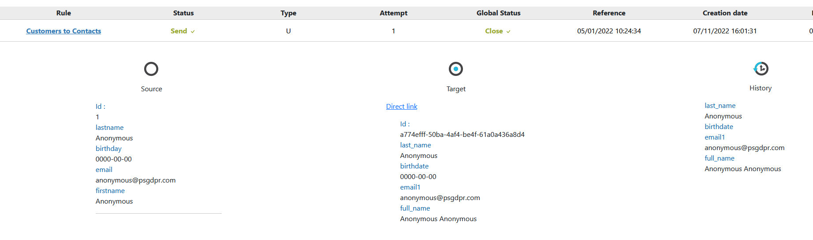

Notice that in Salesforce, the contact's name was "Doe test" and but the name that was sent is "Doe".
The name is now modified in Salesforce. Return to the rules list view and click again on "Execute all active rules".
Another transfer is sent as a result of Myddleware reading in Salesforce and detecting the modification we've just made.
The transfer will automatically be cancelled to avoid an infinite loop :

The reason for this being that the data is already updated in Moodle (which is normal since Moodle is the source
solution from which the data is being sent). So Myddleware detects that there are no modifications to send to Moodle
and thus cancels the transfer and stops what could result in an infinite loop.

Now you have to do this test in the opposite direction. To do so, modify the contact in Salesforce and return to the rule
list view. Click once again on "Execute all active rules". You only need to run the rules once, not twice as we did in
the previous case. In fact, it depends on which rule has been activated first when you click on "Execute all active rules".
In one direction, you have to click on "run all rules" twice, in the other direction, once is enough.

At this point, your modification in Salesforce should be visible in Moodle :

Once Myddleware detects the modification in Moodle, it will try to send it to Salesforce.
But once again, the transfer will be cancelled to avoid an infinite loop :

If the transfer isn't cancelled, your server will continue to update the same contacts every time. To avoid this, you will
have to detect why the transfer isn't cancelled. It could be because you used the modification date, or because the data
format is not the same in both applications.
To solve this problem, remove some fields in your rule or create a formula to have the same data format in both applications

## Workflows
Workflows enable the automation of tasks when specific conditions are met. In the context of data migration, they offer a powerful feature that allows for more efficient linking of your data. By automating these connections, workflows not only streamline the process but also help ensure consistency and accuracy in how data relationships are established and maintained throughout the migration.

### Create a workflow
To create a workflow, 
1) Navigate to the Rule’s tab and select ``List of workflows``
2) Click on ``Create new workflow``
   
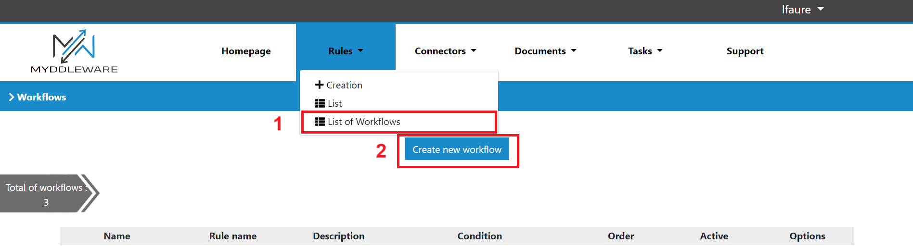

A form will be displayed, and you will need to fill it, in order to create your workflow. You will have to set : 
1) The name
2) The rule the workflow is related to
3) The description
4) The order it will be launched
5) The condition that will trigger the workflow

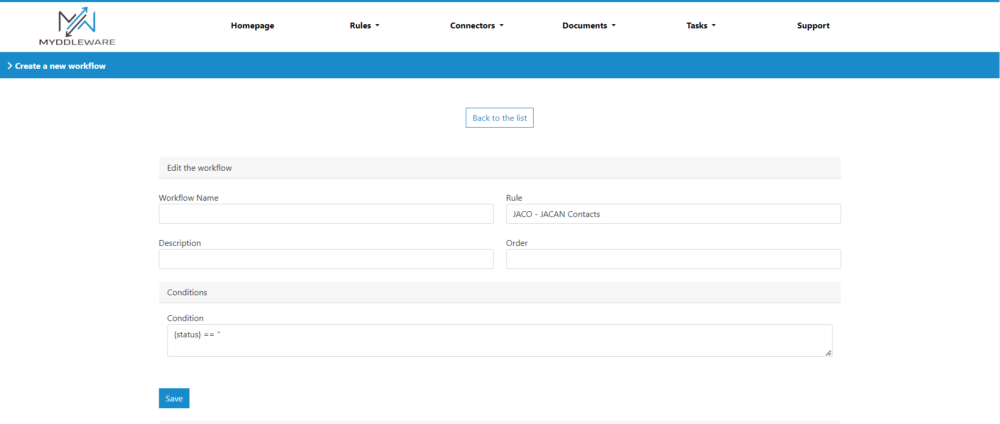

The code you will use for condition is PHP. It is structured as follows:

        {variable_1} == "Your_condition"

You can write multiple conditions :

        {variable_1} == "Your_condition1" && {variable_2} == "Your_condition2"
**Important : Your variables must be enclosed in { }** 

You can create a condition based on :
1) Document Status (variable name : ``status``), ex: "Ready_to_send", "Send", "Error_transformed" 
2) Document Type (variable name : ``documentType``), ex : "C", "U", "S"
3) Document Attemps (variable name : ``attempts``), number
4) A source field data (format : add the prefix source_ before your field name : ``source_fieldname``)
5) A target field based on history data (format : add the prefix history_ before your field name : ``history_fieldname``)
6) str_contains({message},"Your message")

For exemple, you want to create a workflow that triggers when your document status is Error_transformed and your documentType is C

        {status} == "Error_transformed" && {documentType} == "C"

Then click on save. You are redirected to the workflow detail page. 

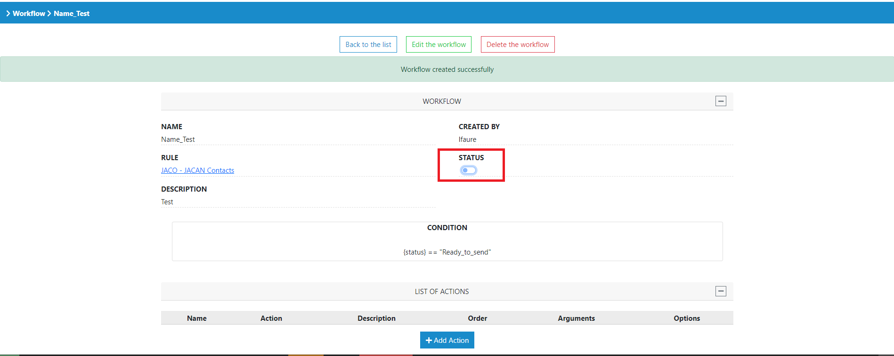

Click on ``status`` to enable/disable the workflow.  
### Workflowaction

A workflow action allows you to initiate an operation when the conditions are met to trigger the workflow. 

#### Create an action
To create an action, click on ``+ Add Action`` on the workflow details view. 

A form will be displayed, and you will need to fill it, in order to create your action. You will have first to :
1) Fill ``Action Name`` field
2) Ensure that the associated workflow is the one you want in ``Workflow`` field
3) Fill ``Description`` field
4) Define the order of the action in the workflow process execution, in ``Order`` field.
5) Define if you want your action to be Active or inactive, in ``Active``
   
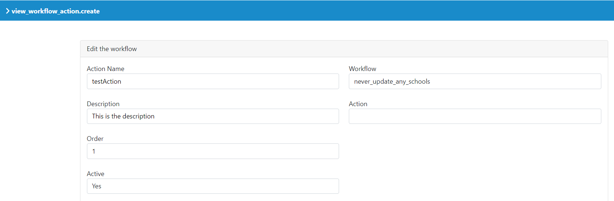

Then choose an action. There are 5 different actions, which are detailed below.

##### updateStatus
This action allows you to change the status of a document. For exemple, you want to cancel data sending when your workflow is triggered. To achieve this:
1) First, select **updateStatus** from ``Action`` dropdown.
2) Then fill ``status``. There are 5 possible choices.  

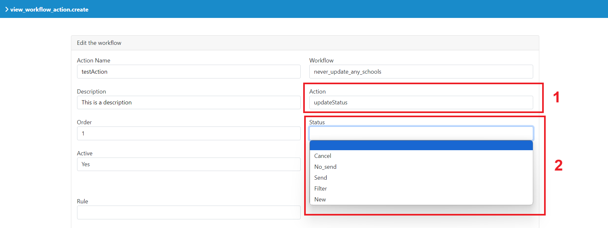

##### generateDocument
This action allows you to create a document (to send data) via another rule. For example, in the context of a university, when a school is sent through a rule called 'Send_School' (with the document status set to 'Sent'), you may want to send the contact associated with this school through the rule 'Send_contact'. To achieve this:

1) First, select **generateDocument** from ``Action`` dropdown.
2) Add the name of the field in the actual rule (``searchValue``). In this exemple, the contact ID in the 'Send_school' rule.
3) Add the name of the field in the related rule (``searchField``). In this exemple, this would be a field containing the source ID of the school.
4) Define the related rule that will generate the document (``Rule``). In this exemple, the'Send_contact' rule.
5) Define whether to rerun the workflow or not (``Rerun``).

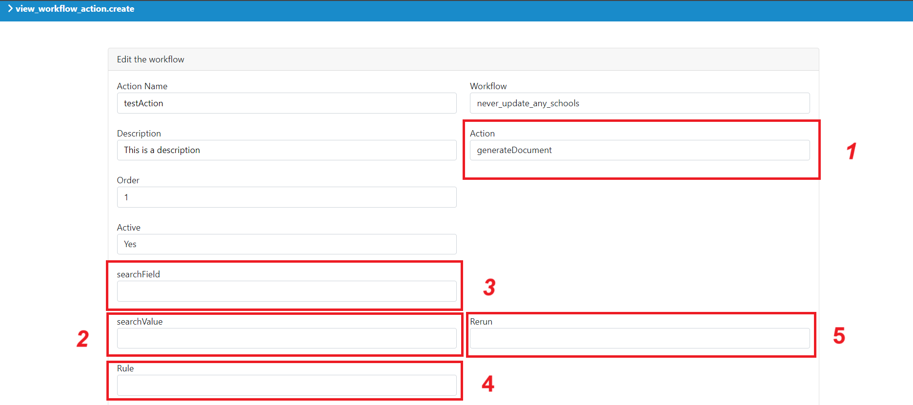

##### sendNotification
This action allows you to send an email to inform user about an element of your data. For exemple, you can send a notification if some fields are missing. To achieve this:
1) First, select **sendNotification** from ``Action`` dropdown.
2) Add ``Subject`` : Object of the notification
3) Fill ``Message``  : The message you want to send 
4) Fill ``To`` : one or many users email address (address separated by semicolon)

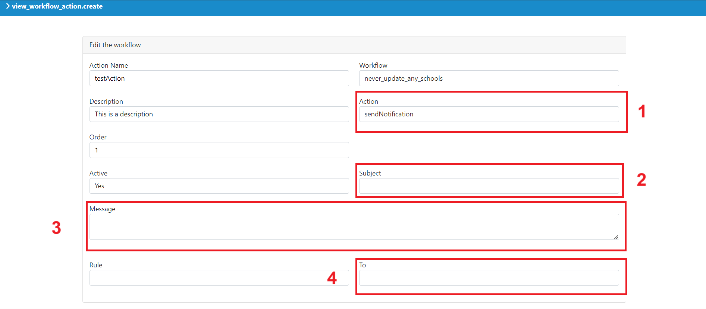

##### transformDocument
This action allows you to unlock data sending. For exemple, during data migration, some documents are linked to other documents. If a linked document hasn't been sent before, the current document will show an error with the status 'Error_transformed'. To fix this, we trigger a workflow containing an action that sends the missing linked document. After that, action **transformDocument** updates the actual document status "Error_transformed" to "Transformed" of the current document so it is no longer in error and can be sent properly during the next synchronization. You just need to select **transformDocument** from ``Action`` dropdown.

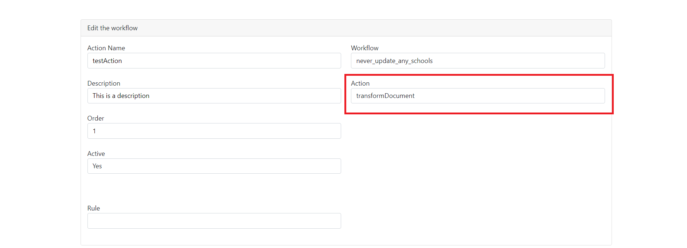

##### changeData
This action allows the system to modify the value of a specific field whenever the workflow is triggered. For exemple, you want to create and update a CRM (CRM_1) user from another CRM (CRM_2) contact, the user is created with a password. However, when updating the user, the password should not be updated. To handle this, the changeData action modifies the password field during an update, setting its value to "mdw_no_send_field", ensuring the password remains unchanged.
To achieve this:
1) First, select **changeData** from the ``Action`` dropdown.
2) Select the rule with the fields you want to modify
3) Click on the ``Add Field`` button to create a first field change

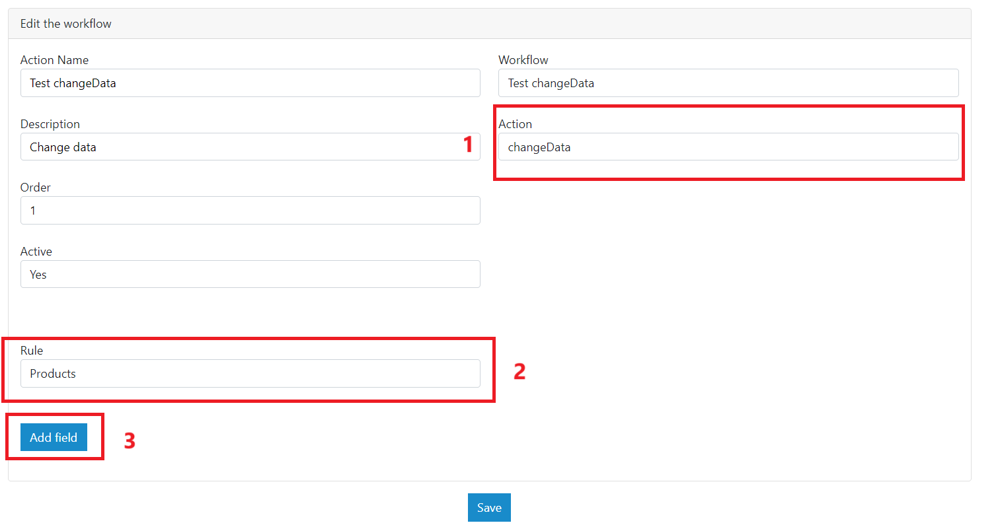

4) Select the name of the target field you want to change (``Target Field``).
5) Add the new value for the field (``New Value``).
6) You can add additional field changes by clicking on ``Add Field`` button.


## Variables
Sometimes, it's necessary to hard-code values like course IDs, names, etc., directly into rules. This feature allows those values to be grouped in a central location, where they can be assigned to variables and referenced by their variable names in the rules. This way, if any of these values (like IDs) need to be changed, you only need to update them in one place, simplifying management and reducing the risk of errors.

### Create a variable
To create a variable, 
1) Navigate to the Rule’s tab and select ``List of variables``.
2) Click on ``Create new variable``
3) A form will be displayed, fill ``variable name`` and its ``value``.

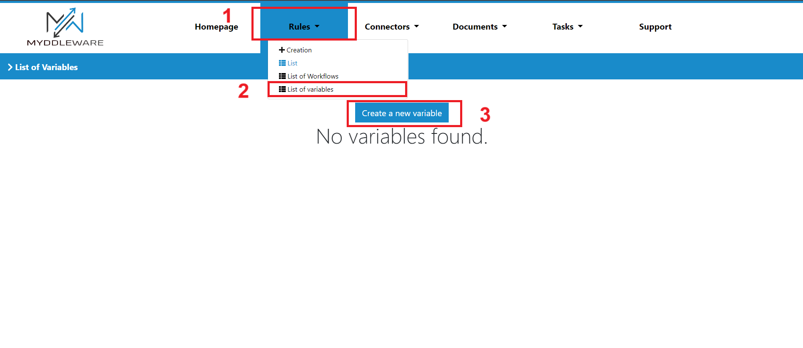

You will see the variable in the List view. The prefix mdwvar_ has been added on its name. 

To call this variable, go on a Rule field and write your variable in the formula area.  
**Important : your variable must be enclosed with { } and you have to call it with prefix ``mdwvar_`` as below** 


