# Basic usage

## Connectors

In order to be able to synchronise data from your applications, Myddleware relies on *connectors*.
A connector is the object which allows Myddleware to connect to your solution (SuiteCRM, WooCommerce or Prestahop for example). 
Thanks to connectors, Myddleware can read and/or write data into the connected solution. Therefore, each solution you would like Myddleware
to interact with, whether it be as a source or target application, will need to have its own Myddleware connector.

> For the same solution, you can have multiple connectors. For example, let's imagine you own 3 WooCommerce websites, you can have a connector for each of these. 
> You can even have multiple connectors for the same application, for instance by connecting to the app using various credentials.

### Create a connector

To create a connector, navigate to the **Connectors** tab and select *Creation*

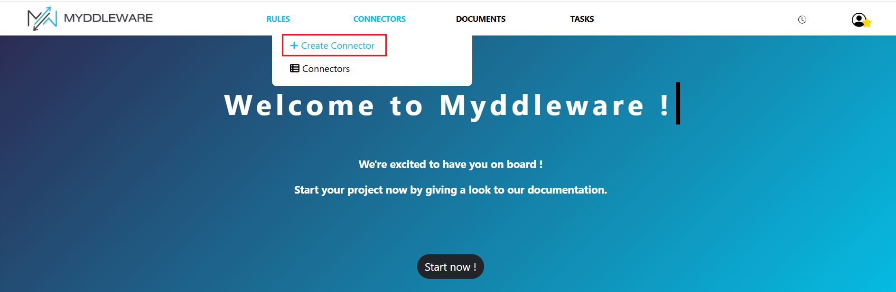

Now, first select the solution you would like to connect. In the example below, we've selected SuiteCRM. Each solution uses their own custom credentials.
A form will therefore be displayed which you will need to fill in using the credentials provided by your solution.
To ensure your credentials are accurate, you can click on the **Test** button and Myddleware will let you know right away whether the connection was successful or not.

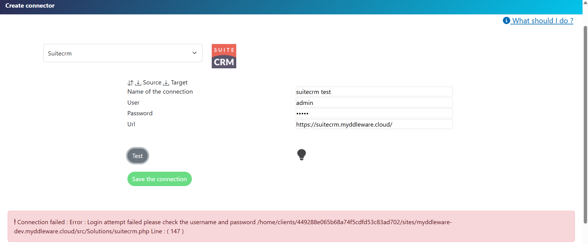

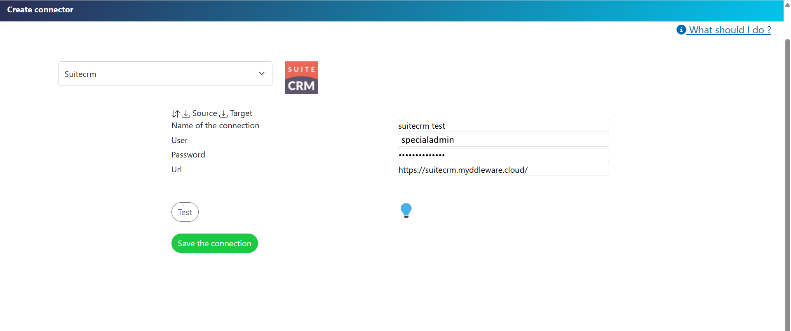

If the credentials are right, you may now save your connector. You will then be redirected towards the list of all your connectors.


### View my connectors

To access the list of all your connectors, simply go to the **Connectors** tab and select *List*.

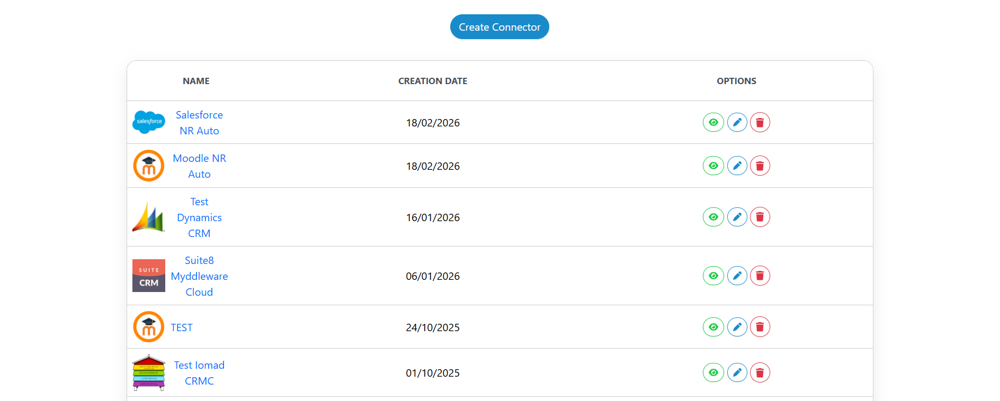

From here, you will be able to either update or delete a connector if needed by clicking on the icons in the **options** section.

### Edit or delete a connector

If your solution credentials have changed, you can update a connector, test whether the credentials are still valid and then save your updated connector. 

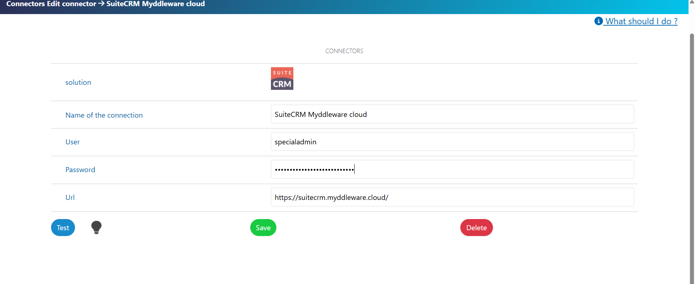

## Rules

### Create a rule

> Rules are at the core of how Myddleware works. You can create as many as you want and as many as you need, but each rule will require a **source** connector & a **target** connector.

A rule is basically a job which sends your data from a module to another module. It's just like transfering something from a box to another, with all the changes it implies if the first box is square and the second is a circle. The transfer is a copy, so no data can be erased.

To create a rule, log in to your Myddleware instance then click on **Rules** then **Creation** in the navbar.

> **Tip**: If you want to quickly set up a common integration scenario, you can use **Rule Templates** instead of creating rules from scratch. See the [Rule Templates](#rule-templates) section below.

#### Name your rule

The first step is to fill in the **Rule Details** section. Give your rule a name and optionally a description. Myddleware will check that the name is available and display a green checkmark if it is.

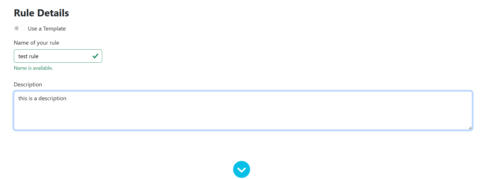

#### Select connectors and modules

Next, in the **Rule connection** section, you need to configure the source and target for your rule:

1. **Solution**: Select the source and target solutions (e.g., Moodle and SuiteCRM)
2. **Connector**: Select the corresponding connectors you have previously created for each solution
3. **Module**: Select the source module (where data will be read from) and the target module (where data will be sent to)

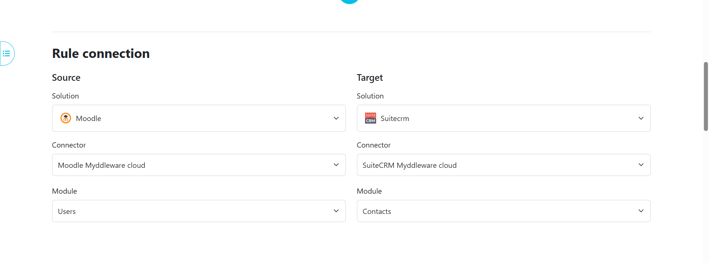

In the example above, we've chosen to create a rule which will have Moodle as a **source** from which to read data, which will then be sent to SuiteCRM as a **target**. We selected ```Users``` as a source module and ```Contacts``` as a target module.

!> It is important to know exactly from which module the data you need comes from, and in which module you want it to be copied. Indeed, you won't be able to change this part later.

#### Map some fields

Once you've named & decided on the modules you want to synchronise, you will be redirected to the fields mapping step. This is where you will define the general pattern for each data transfer made by your rule, field by field.

For each field mapping, you need to select a **target field** (on the left dropdown) and one or more **source fields** (on the right dropdown). You can map as many fields as you need and can even send multiple source fields into one target.

> NB: please note you don't need to map *all* source/target fields, you can simply select a few if that's what you need. However, some of them will be required, depending on the target application. Required fields will be marked with a star symbol next to their name in Myddleware.

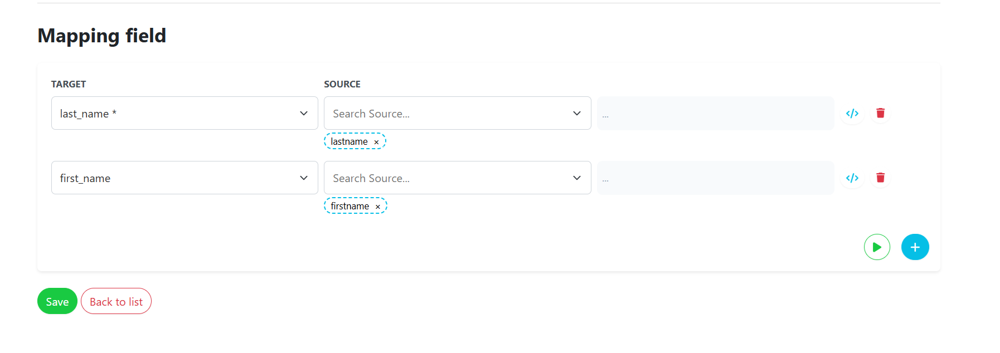

#### Apply formulae to transform data before it is sent to the target app

Sometimes, the source data mapping doesn't quite match the target app's own mapping. But don't worry!
Myddleware allows you to operate transformations on the data you want to send in order to fit with the target requirements.
This is possible thanks to Myddleware's *formulas* system.
Indeed, for each target field, you can create a formula to modify the source data to fit the type, length, format... and other requirements from the target field.

###### Simple string concatenation formula example

In our example, we want to map Moodle users' data to be sent to SuiteCRM's ```Contacts``` module.
However, SuiteCRM provides a ```full_name``` target field, but Moodle only has separate ```firstname``` and ```lastname``` fields.
To solve this, we need to select both ```firstname``` and ```lastname``` as source fields for the ```full_name``` target, and then create a formula to concatenate them.

To do so, click on the formula icon (```</>```) next to the target field. The **Compose your formula** modal will open, showing:

- **Selected fields**: The source fields you have mapped (e.g., ```firstname``` and ```lastname```)
- **Function Wizard**: A dropdown to search and apply built-in functions, with a parameter field
- **Formule**: The formula editor where you write your expression

The code you use for formulas is PHP syntax. To concatenate 2 fields with a space in between, use ```." ".``` between your variables:

````php
{firstname}." ".{lastname}
````

This would produce the following result in the target application:

````text
John Doe
````

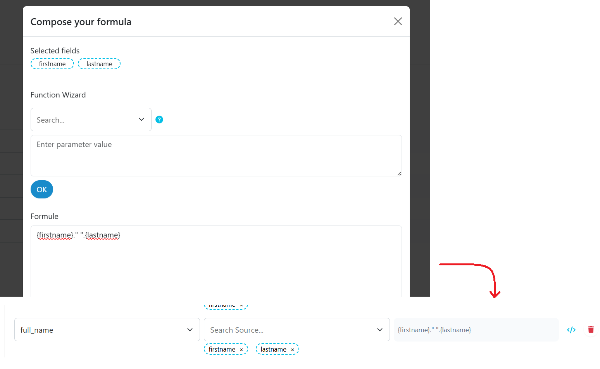

> For more advanced formula techniques such as pre-formatting data using the target application's values, check out the [Formulae section](advanced_usage.md?id=pre-formatting-data-using-the-target-application) in the Advanced Usage guide.

#### Simulate a data transfer

To test your formula and your fields' mapping, click the **Simulation** button. A modal will open where you can run two types of simulations:

- **Simple simulation**: Runs a simulation on a random record from your source application. Click the green **Simple simulation** button to visualize a sample data transfer and check whether your formulae transform the data as expected.

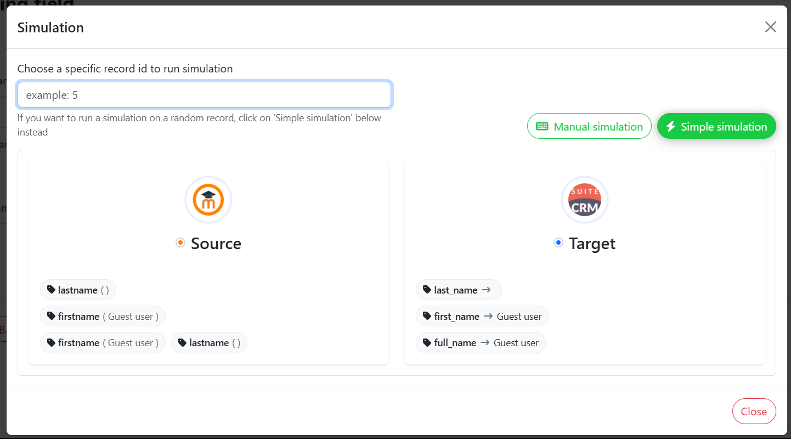

- **Manual simulation**: If you want to test with a specific record from your source application, enter its ID in the field at the top (e.g., ```67```) and click **Manual simulation**. This is useful to verify that a particular record will be transformed correctly.

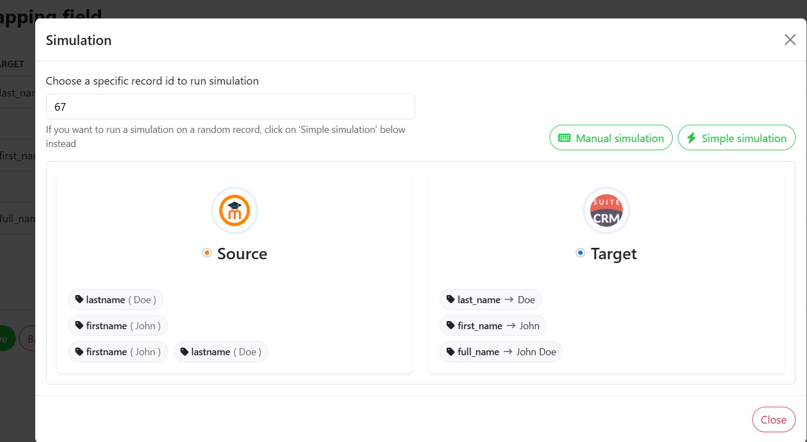

The simulation results display the **Source** data (read from your source application) and the **Target** data (what will be sent to the target), so you can verify the field mappings and formula transformations. In the example above, the Moodle user with ID 67 has ```firstname``` = "John" and ```lastname``` = "Doe", and the formula correctly produces ```full_name``` = "John Doe" in the target.

If you are satisfied with the current simulation, you can proceed to the **Sync options** section below to finalize your rule,
or you can make even further transformations to your data by adding ```Filters``` & ```Lookup formulas``` to your rule. To find out more about these options,
please go to the [Advanced usage section](advanced_usage.md?id=linking-data-across-rules-with-lookup-formulas) of this documentation.


#### Confirm & create the rule

The **Sync options** section allows you to configure how your rule handles data synchronization.

##### Synchronisation type

Select the synchronisation type from the **Synchronization type** dropdown:

- **Create and update data**: Reads both new and modified records from the source (most common)
- **Create data only**: Only reads newly created records from the source
- **Update data only**: Only reads modified records from the source
- **Retrieving existing data only**: Only retrieves existing records without creating or updating

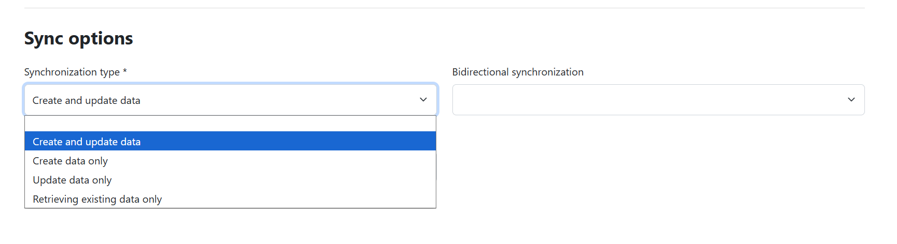

##### Avoid duplicate fields

To prevent sending duplicate data, you can select which target field should be used to check for existing records. In the **Fields to avoid duplicates** dropdown, search and select the field that should be unique. In our example, we use ```email1``` so that Myddleware will update existing records instead of creating duplicates.

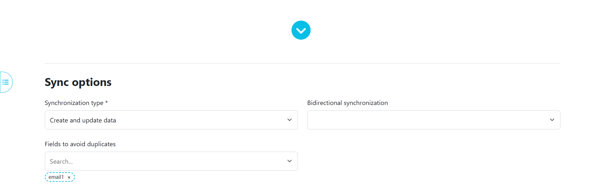

!> In order for this feature to work, the field used to avoid duplicate records must be mapped. If needed, go back to the fields mapping section and add it.

You may now click on **Save** to create and save the rule.

### Rule details

You can view a summary of each of your rules by selecting it from the list. The rule detail page is divided into two panels:

- **Details**: Shows the rule's ID, name, creation/modification dates, synchronisation mode, fields to avoid duplicates, and description. The name and description can be edited inline by clicking the pen icon.
- **Connectors**: Shows the source and target solutions, connectors, and modules used by this rule, with links to go directly to each connector.

At the top of the page, you will find action buttons depending on your permissions:

| Action               | Description                                                                                                                                      | Permissions |
|----------------------|--------------------------------------------------------------------------------------------------------------------------------------------------|-------------|
| Run the rule         | Run the rule manually, even if the **Enabling the automatic synchronisation** switch is off                                                      | user        |
| Run the rule by id   | Run the rule for a specific record ID from the source application                                                                                | user        |
| Edit the rule        | Edit this rule. You can change the fields that are being mapped, filters, formulas and other parameters. However, you may not change the connectors & modules used. | user |
| Display the documents | View all data transfers (also called documents) generated by the rule so far                                                                    | user        |
| Duplicate a rule     | Generate a perfect copy of this rule                                                                                                             | user        |
| Delete the rule      | Delete this rule                                                                                                                                 | user        |
| Cancel documents     | Cancel all Myddleware documents related to this rule which have not been sent yet (documents in error or still pending)                           | admin       |
| Delete documents     | Delete all previous Myddleware documents (data transfers) related to this rule                                                                   | admin       |

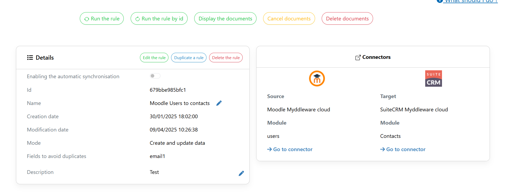

You can see an **Enabling the automatic synchronisation** switch which allows you to enable or disable automatic synchronisation.
If this option is on, the background job will run this rule automatically.
If it is off, the background job will skip this rule and you will need to run it manually.
Checkout the [Job scheduler & cron tasks section](cron_jobs.md) for more details about background jobs and how to turn them on.

### Fields mapping summary

If you go to the **Field Mapping** tab, you can see a summary of the fields that are mapped for this rule. Each card displays the target field name (in bold), the source field(s) mapped to it (in blue), and whether a formula is applied. You can use the search bar to filter fields by name.

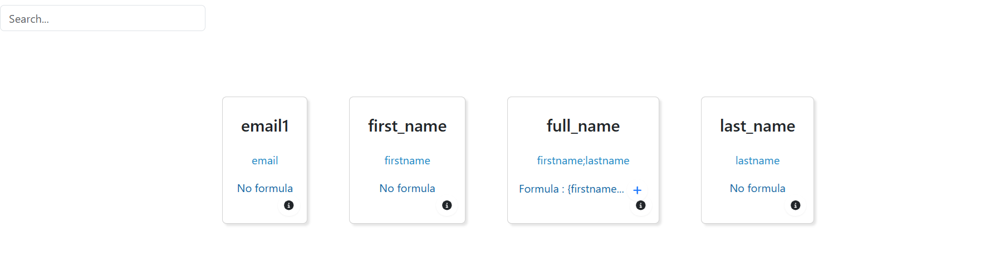

### Rule Parameters

From the rule's detail view, you can access the **Parameters** tab. This is where you configure the reference date, read limit, and data deletion settings.

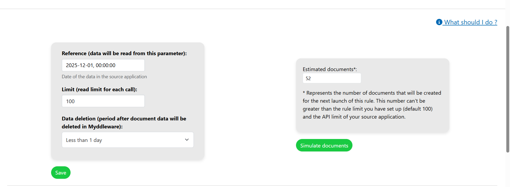

| Parameter      | Description                                                                                                                                                                                                                                                                                                                                                                                                                                                                                                                                             |
|----------------|---------------------------------------------------------------------------------------------------------------------------------------------------------------------------------------------------------------------------------------------------------------------------------------------------------------------------------------------------------------------------------------------------------------------------------------------------------------------------------------------------------------------------------------------------------|
| Reference      | The date from which Myddleware starts reading data from the source application. <br/>For example, if you set today's date, only today's created or modified data will be sent to your target application. <br/>(This also depends on the mode of your rule: the "Create and update data" rule mode concerns modified data while the "Create data only" rule mode concerns created data). If you want to migrate your data, all you need to do is put this date in the past. <br/>Then all created/modified data after this date will be read by Myddleware. |
| Limit          | The maximum number of records read in one go by Myddleware (read limit for each call). Default: 100.                                                                                                                                                                                                                                                                                                                                                                                                                                                    |
| Data deletion  | The period after which document data will be deleted in Myddleware. To be able to do so, you must first set the ```clear data``` background job via the [job scheduler](cron_jobs.md).<br/> This job will delete all previously-transferred documents for this rule, except for their IDs, which Myddleware needs.                                                                                                                                                                                                                                       |

You can click on the reference date field to open a datetime picker and select the exact date and time.

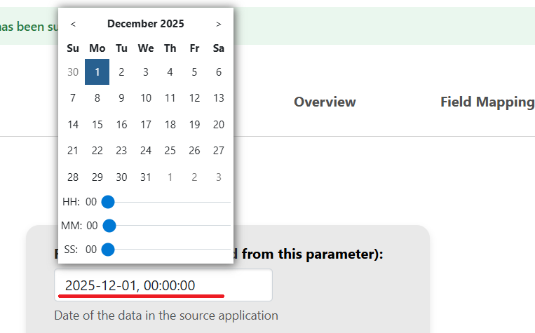

On the right side, the **Estimated documents** panel shows how many documents will be created on the next launch of this rule. Click **Simulate documents** to refresh this number. Note that this number can't be greater than the rule limit you have set up and the API limit of your source application.

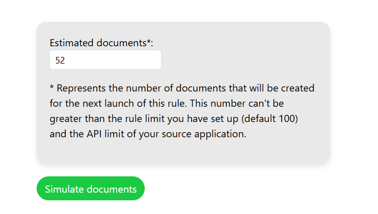

!> For a rule to be able to run, you absolutely MUST click on the **Save** button after setting your reference date. Otherwise, Myddleware will execute the rule using the current timestamp, so no documents will be read.

### Run a rule

To manually run a rule, go to its details view and click **Run the rule**. The rule detail page also provides tabs for **Overview**, **Field Mapping**, **Filters**, and **Parameters**.

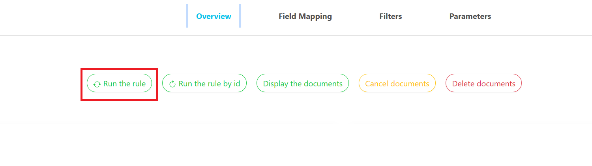

#### Task details

Once the rule has been launched, you will be redirected to the task summary. This page shows the task's ID, status, start date, and parameters. You can click **REFRESH** to update the status or **STOP TASK** to cancel the execution. Below the task summary, you can see the list of logs with each document's ID, reference, creation date, type, and status message.

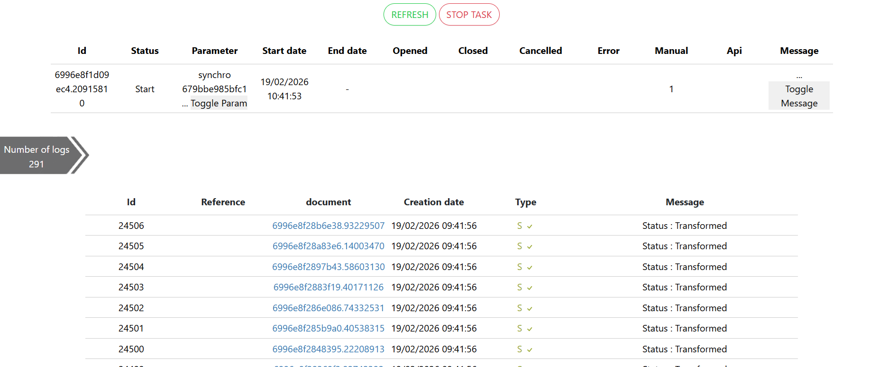

You can also view the list of all previously ran tasks. Each task shows its parameter (e.g., the rule ID or "synchro ALL"), status, start/end dates, and a breakdown of opened, closed, cancelled, and error documents.

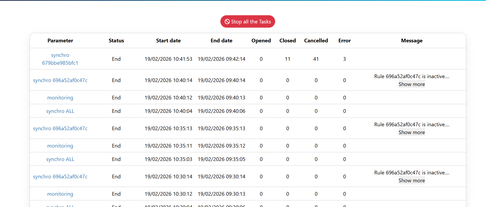

#### Documents

Documents (data transfers) can be viewed by clicking on **Display the documents**. The documents list shows the Doc ID, rule name, creation/modification dates, status, source ID, target ID, type, and reference date. You can filter and search documents using the controls at the top.

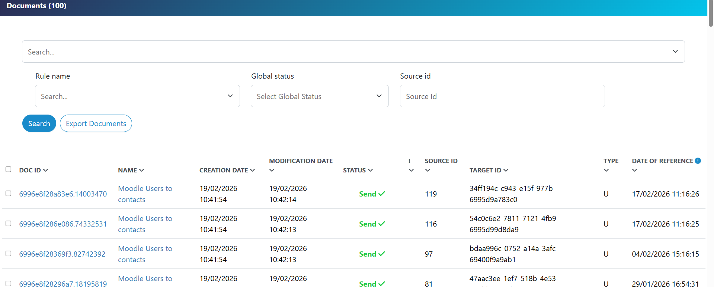

You can access the detail for each individual document by clicking on its Doc ID. The document detail page displays three columns:

- **Source**: The data read from the source application (with the source field names and values)
- **Target**: The data that was sent (or will be sent) to the target application
- **History**: Previous values of the target fields, with modified values highlighted in yellow

At the top, you can see the document's rule, status, type, attempt count, global status, reference date, and creation/modification dates. Action buttons allow you to **Reload**, **Cancel**, or **Run the same record** again.

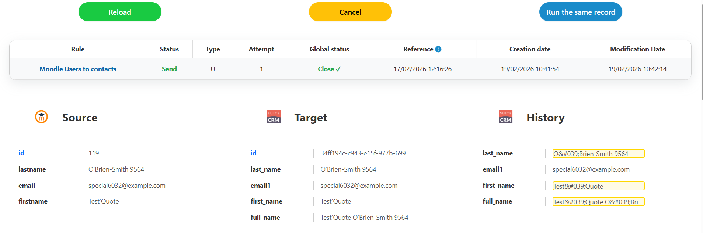

##### Handling documents in error

When a document is in error, you can fix it directly from the document detail view. Click on a target field value to show the full value and have a pen icon appear, then click on the icon to edit it inline, then click the validation icon (green checkmark) to confirm or the cancel icon to discard your changes. Once the data is corrected, click **Reload** to resend the document or **Cancel** to cancel it.

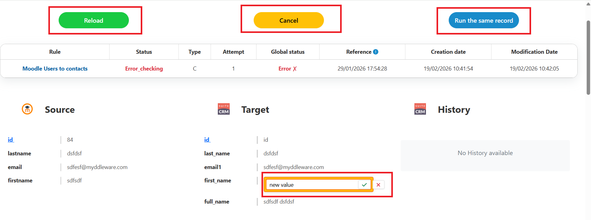

##### Mass actions

You can reload or cancel multiple documents at the same time.

> Only documents in error can be reloaded or cancelled.

Click on the checkboxes to select the document(s) you want to reload or cancel and click on ``Cancel documents`` or ``Reload documents``.

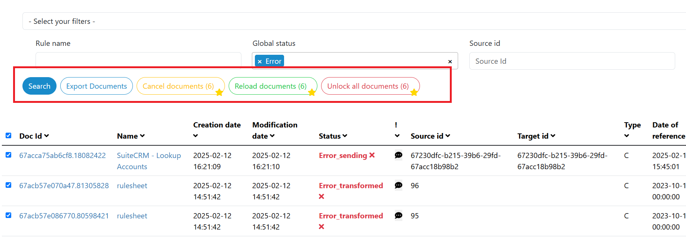

## User Management

Myddleware provides a web-based user management interface that allows administrators to create, edit, and delete users directly from the application.

> To access the User Management page, click on the user icon in the top-right navigation bar and select **Users**.

### User list

The user management page displays a table of all registered users with the following information:

- **Username**: The user's display name
- **Email**: The user's email address
- **Last Login**: The date and time of the user's last login
- **Roles**: The roles assigned to the user (User, Admin, Super Admin)
- **Timezone**: The user's configured timezone
- **Actions**: Edit and Delete buttons (depending on your permissions)

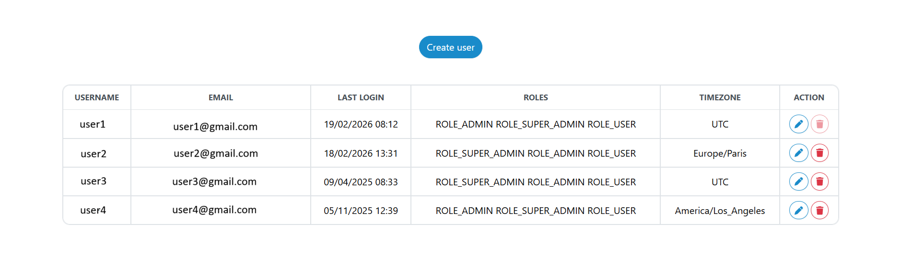

### Create a user

To create a new user, click on the **Create User** button on the user list page. A form will be displayed with the following fields:

1. **Username**: The user's display name (used to log in)
2. **Email**: The user's email address
3. **Password**: The user's password
4. **Roles**: Select one or more roles for the user:
   - **User** (ROLE_USER): Standard access to rules, connectors, and documents
   - **Admin** (ROLE_ADMIN): Can manage users and access additional settings
   - **Super Admin** (ROLE_SUPER_ADMIN): Full access to all features, including deleting rules and cancelling documents in bulk
5. **Timezone**: The user's timezone

Click **Create User** to save.

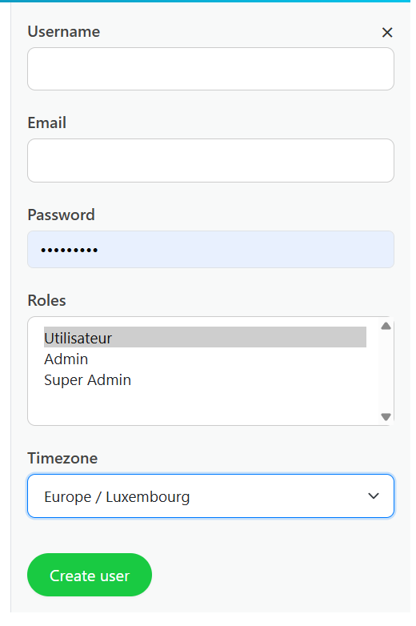

### Edit a user

Click on the edit icon (pen) next to a user in the list to open the edit form. You can update the user's username, email, roles, and timezone.

> Note: the password cannot be changed from this form. Users can change their own password from the **My Information > Security** section.

### Delete a user

Click on the delete icon (trash) next to a user in the list. A confirmation dialog will appear before the user is deleted.

!> You cannot delete your own account. Only Admins and Super Admins can delete other users, and Admins cannot delete Super Admins.

### Permissions summary

| Action      | User | Admin | Super Admin |
|-------------|------|-------|-------------|
| View users  | -    | ✔     | ✔           |
| Create user | -    | ✔     | ✔           |
| Edit self   | ✔    | ✔     | ✔           |
| Edit others | -    | ✔ (except Super Admins) | ✔ |
| Delete user | -    | ✔ (except Super Admins) | ✔ |

## Document Filtering and Export

When working with many rules and documents, you can use the advanced document filtering system to search, filter, and export your data transfers.

### Filtering documents

To access the document filter, navigate to **Rules > Documents**. You can filter documents using the following criteria:

| Filter | Description |
|--------|-------------|
| Reference | The source document ID |
| Status | Document processing status (e.g., Send, Error_sending, Ready_to_send, Cancel) |
| Global Status | High-level status: Open, Close, Cancel, or Error (multiple selection supported) |
| Type | Transfer type: C (Create), U (Update), D (Delete), S (Search) |
| Rule Name | Filter by a specific rule |
| Source/Target Content | Search within the actual data transferred |
| Date Range | Filter by modification date (start and end) |
| Source/Target ID | Filter by specific record IDs |

Filters persist in your session so you can navigate away and come back to the same filtered view.

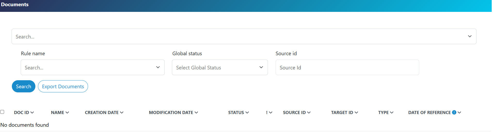

### Exporting documents to CSV

You can export filtered documents to a CSV file. Select the documents you want to export using the checkboxes, then click on **Export CSV**.

The export respects your user preferences for:
- **CSV separator**: Semicolon, Comma, Tab, or Pipe (configurable in **My Information > Preferences**)
- **Date format**: Your preferred date format
- **Charset**: UTF-8, ISO-8859-1, or Windows-1252

## Rule Templates

Rule templates are pre-built integration scenarios that allow you to quickly create multiple related rules at once. Instead of manually creating each rule, mapping fields, and configuring relationships one by one, you can apply a template that sets everything up for you.

### Using a template

To use a rule template:

1. Navigate to **Rules** > **Creation**
2. Toggle the **Use a Template** switch at the top of the page
3. Give your rule a name and optionally a description
4. Select your source and target solutions and connectors in the **Rule connection** section
5. If templates are available for this combination of solutions, they will be displayed as cards in the **Use a Template** section at the bottom
6. Each card shows the template name, description, the number of rules included, and the module mappings for each rule
7. Click **Use this template** to apply it

Myddleware will automatically create all the rules defined in the template, including their field mappings, filters, and lookup formulas.

> Templates are available for common integration scenarios between popular solutions (e.g., Moodle to Salesforce, PrestaShop to ERPNext, WooCommerce to vTiger CRM). The available templates depend on which connectors you have selected.

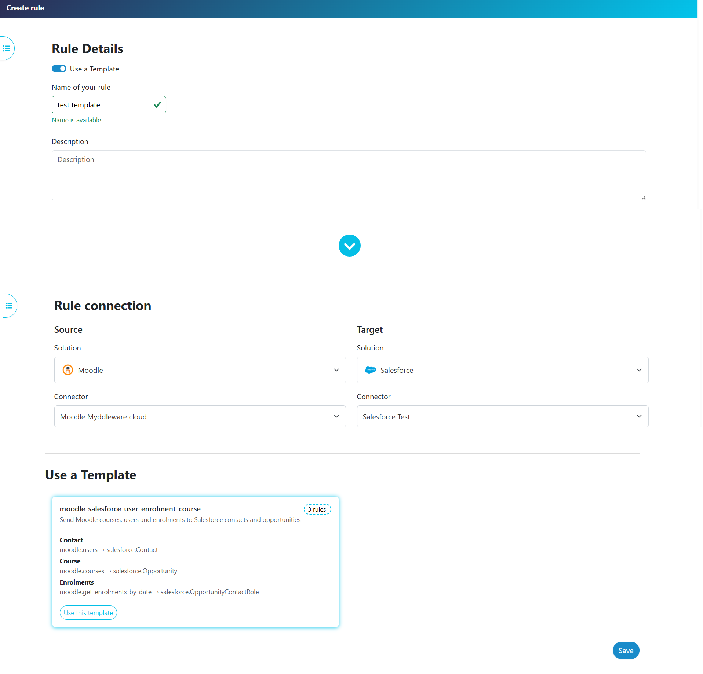

## Going further

If you would like to find out about more complex use cases, such as linking data across rules with lookup formulas, filters, workflows and other amazing features, please checkout the [Advanced Usage section](advanced_usage.md)
