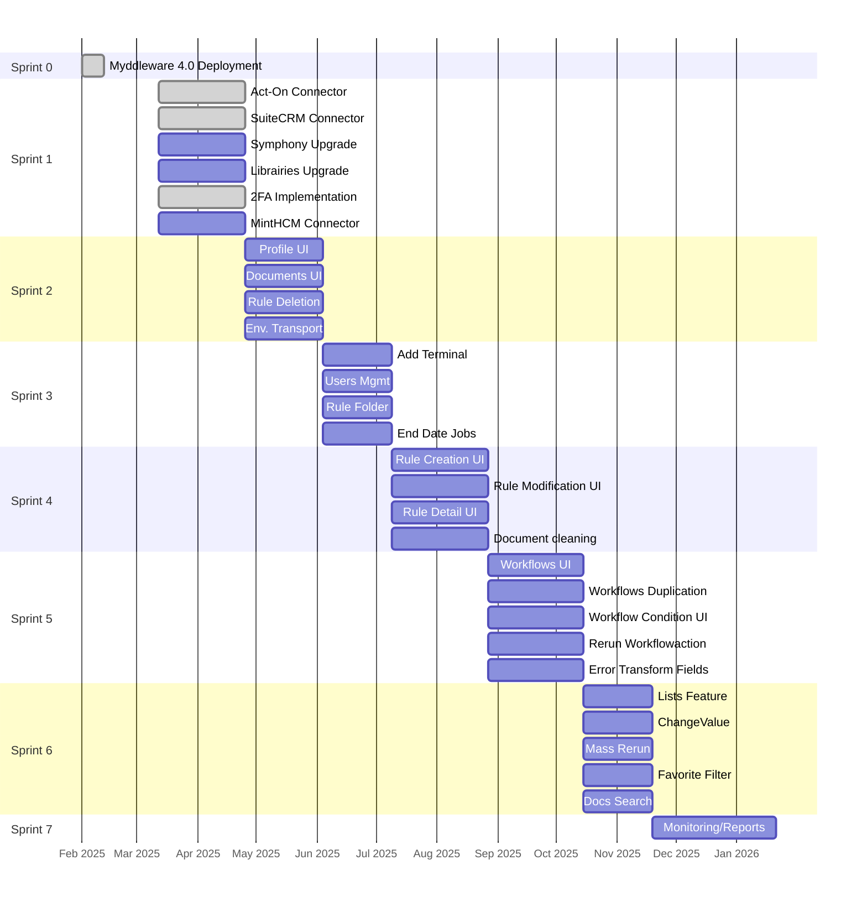

# Project Roadmap

```mermaid
gantt
    dateFormat YYYY-MM-DD
    axisFormat %b %Y
        
    section Sprint 0
    Myddleware 4.0 Deployment       :done, 2025-02-01, 2025-02-12

    section Sprint 1
    Act-On Connector    :done, 2025-03-12, 2025-04-25
    SuiteCRM Connector    :done, 2025-03-12, 2025-04-25
    Symphony Upgrade       : 2025-03-12, 2025-04-25
    Librairies Upgrade    :2025-03-12, 2025-04-25
    2FA Implementation           :done, 2025-03-12, 2025-04-25
    MintHCM Connector    :2025-03-12, 2025-04-25

    section Sprint 2
    Profile UI        :2025-04-25, 2025-06-04
    Documents UI         :2025-04-25, 2025-06-04
    Rule Deletion       :2025-04-25, 2025-06-04
    Env. Transport     :2025-04-25, 2025-06-04

    section Sprint 3
    Add Terminal             :2025-06-04, 2025-07-09
    Users Mgmt        :2025-06-04, 2025-07-09
    Rule Folder        :2025-06-04, 2025-07-09
    End Date Jobs        :2025-06-04, 2025-07-09

    section Sprint 4
    Rule Creation UI   :2025-07-09, 2025-08-27
    Rule Modification UI     :2025-07-09, 2025-08-27
    Rule Detail UI       :2025-07-09, 2025-08-27
    Document cleaning        :2025-07-09, 2025-08-27

    section Sprint 5
    Workflows UI        :2025-08-27, 2025-10-15
    Workflows Duplication    :2025-08-27, 2025-10-15
    Workflow Condition UI        :2025-08-27, 2025-10-15
    Rerun Workflowaction   :2025-08-27, 2025-10-15
    Error Transform Fields   :2025-08-27, 2025-10-15

    section Sprint 6
    Lists Feature        :2025-10-15, 2025-11-19
    ChangeValue         :2025-10-15, 2025-11-19
    Mass Rerun           :2025-10-15, 2025-11-19
    Favorite Filter         :2025-10-15, 2025-11-19
    Docs Search     :2025-10-15, 2025-11-19

    section Sprint 7
    Monitoring/Reports       :2025-11-19, 2026-01-21

  
```