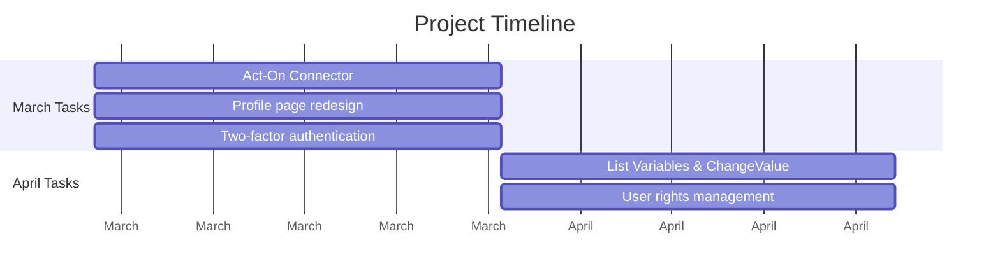

# Project Roadmap

This creates a basic Gantt chart with:
1. A title
2. Date formatting set to YYYY-MM (year-month)
3. Axis labels showing month names
4. Tasks grouped into sections by month
5. Each task showing its duration (1M means one month)

The syntax breakdown:
- `gantt`: Declares this is a Gantt chart
- `dateFormat`: Specifies how dates should be interpreted
- `axisFormat`: Controls how dates are displayed on the axis
- `section`: Groups related tasks
- Task syntax: `Task name : start_date, duration`

You can preview this in any markdown editor that supports Mermaid diagrams. Would you like to:
1. Add more tasks to this basic structure?
2. Adjust the styling?
3. Add more months to the timeline?

Let me know how you'd like to proceed and we can build upon this foundation.