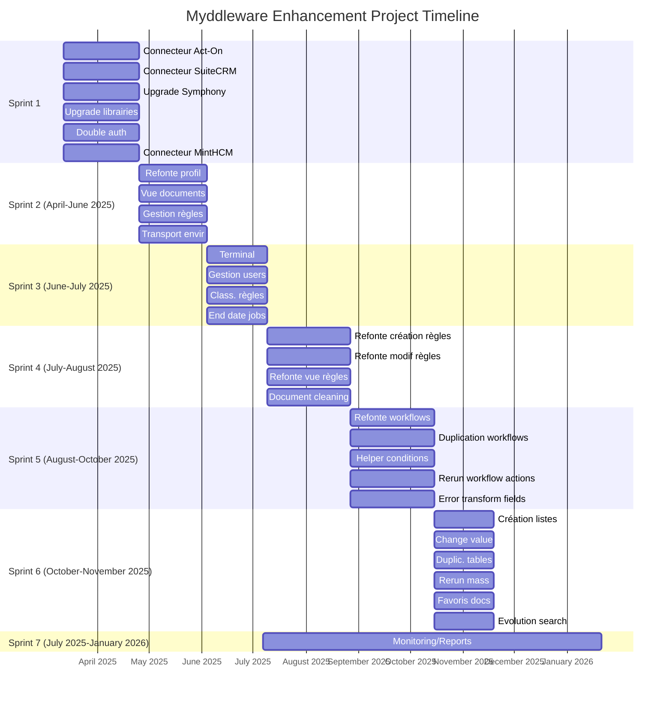

# Project Roadmap

```mermaid
gantt
    title Myddleware Enhancement Project Timeline
    dateFormat YYYY-MM-DD
    axisFormat %B %Y

    section Sprint 1
    Connecteur Act-On       :2025-03-12, 2025-04-25
    Connecteur SuiteCRM    :2025-03-12, 2025-04-25
    Upgrade Symphony       :2025-03-12, 2025-04-25
    Upgrade librairies    :2025-03-12, 2025-04-25
    Double auth           :2025-03-12, 2025-04-25
    Connecteur MintHCM    :2025-03-12, 2025-04-25

    section Sprint 2 (April-June 2025)
    Refonte profil        :2025-04-25, 2025-06-04
    Vue documents         :2025-04-25, 2025-06-04
    Gestion règles       :2025-04-25, 2025-06-04
    Transport envir      :2025-04-25, 2025-06-04

    section Sprint 3 (June-July 2025)
    Terminal             :2025-06-04, 2025-07-09
    Gestion users        :2025-06-04, 2025-07-09
    Class. règles        :2025-06-04, 2025-07-09
    End date jobs        :2025-06-04, 2025-07-09

    section Sprint 4 (July-August 2025)
    Refonte création règles   :2025-07-09, 2025-08-27
    Refonte modif règles     :2025-07-09, 2025-08-27
    Refonte vue règles       :2025-07-09, 2025-08-27
    Document cleaning        :2025-07-09, 2025-08-27

    section Sprint 5 (August-October 2025)
    Refonte workflows        :2025-08-27, 2025-10-15
    Duplication workflows    :2025-08-27, 2025-10-15
    Helper conditions        :2025-08-27, 2025-10-15
    Rerun workflow actions   :2025-08-27, 2025-10-15
    Error transform fields   :2025-08-27, 2025-10-15

    section Sprint 6 (October-November 2025)
    Création listes        :2025-10-15, 2025-11-19
    Change value          :2025-10-15, 2025-11-19
    Duplic. tables        :2025-10-15, 2025-11-19
    Rerun mass           :2025-10-15, 2025-11-19
    Favoris docs         :2025-10-15, 2025-11-19
    Evolution search     :2025-10-15, 2025-11-19

    section Sprint 7 (July 2025-January 2026)
    Monitoring/Reports       :2025-07-07, 2026-01-21
```