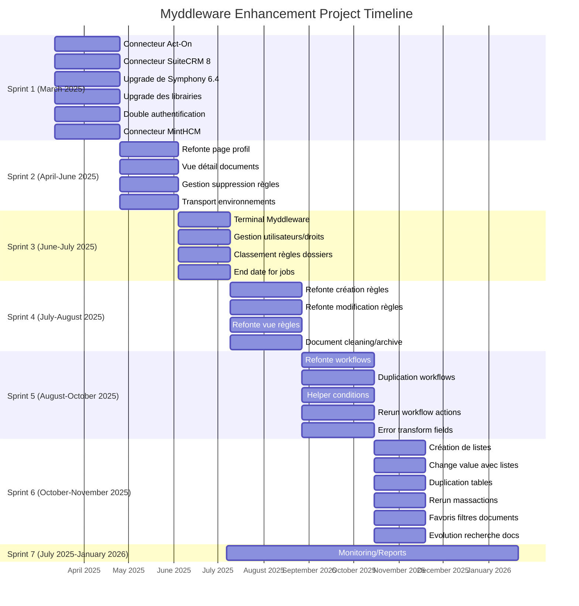

# Project Roadmap

This Gantt chart shows:
1. All tasks organized by sprints
2. Actual start and end dates from the CSV
3. Clear section headers with date ranges
4. Tasks grouped logically by sprint
5. Monitoring/Reports shown separately as it spans multiple sprints

The chart uses:
- YYYY-MM-DD date format for precision
- Month Year axis format for readability
- Sprint-based sections for organization
- Task durations based on the CSV dates

This creates a basic Gantt chart with:
1. A title
2. Date formatting set to YYYY-MM (year-month)
3. Axis labels showing month names
4. Tasks grouped into sections by month
5. Each task showing its duration (1M means one month)

The syntax breakdown:
- `gantt`: Declares this is a Gantt chart
- `dateFormat`: Specifies how dates should be interpreted
- `axisFormat`: Controls how dates are displayed on the axis
- `section`: Groups related tasks
- Task syntax: `Task name : start_date, duration`

You can preview this in any markdown editor that supports Mermaid diagrams. Would you like to:
1. Add more tasks to this basic structure?
2. Adjust the styling?
3. Add more months to the timeline?

Let me know how you'd like to proceed and we can build upon this foundation.